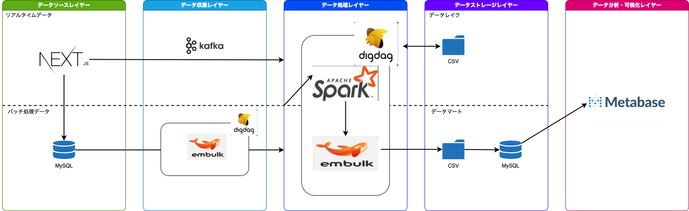

# 文房具ECサイトのデータ分析基盤構築

<p align="center">
  
</p>


[](https://www.docker.com/)


[](https://jquery.com/)


[](https://getbootstrap.com/)
[](https://docs.docker.com/compose/)


このプロジェクトでは、Next.jsフレームワークを使用した文房具を販売するECサイトのデータ分析基盤を構築しました。本READMEでは、採用した技術スタックとプロセスについて詳述します。

# 概要
このデータ分析基盤は、ユーザーデータ、商品データ、売上データ、売上詳細データの効率的な処理と分析を目的としています。以下の技術を駆使し、リアルタイムおよびバッチ処理の両方に対応したシステムを構築しました。

# 採用技術
+ Next.js: Webアプリケーションフレームワーク
+ Embulk: データ抽出ツール
+ Apache Spark: データ処理・分析エンジン
+ Apache Kafka: 分散ストリーミングプラットフォーム
+ Digdag: ワークフローオーケストレーションツール
+ MySQL: 主データベース
+ PostgreSQL: データバックアップ用データベース
+ Metabase: データ可視化ツール

# データパイプライン

<p align="center">
  
</p>

## 1. バッチ処理データ
### データセット
+ ユーザーデータ
+ 商品データ
+ 売上データ
+ 売上詳細データ
### プロセス
+ データ抽出: MySQLデータベースからEmbulkを使用してデータを取得
+ データ整形: Apache Sparkを用いてデータを整形・変換
+ データ保存: 整形されたデータをCSV形式でストレージに保存
+ データ移行: Digdagを利用して、整形後のデータを別のデータベースに移行

## 2. リアルタイムデータ
### データ項目
+ ユーザID
+ 年齢
+ 性別
+ 職業
+ 閲覧している画面
+ 閲覧時刻

### プロセス
+ データ収集: webアプリケーション上でリアルタイムにデータを収集
+ データ送信: Apache Kafkaを介してストリーミングデータを送信
+ データ保存: Spark Streamingを使用してデータをストレージに保存
+ データ移行: Digdagを利用して、リアルタイムデータを別のデータベースに保存

# データベース構成
+ MySQL: メインデータベースとして使用
+ PostgreSQL: データバックアップの目的で使用。データの信頼性と冗長性を確保

# データアクセスレイヤー
+ Metabase: データの可視化および分析ツール。これにより、ビジネスインサイトの迅速な取得が可能

# 起動方法

1.以下のコマンドを実行し、webserverにNEXTAUTHの設定ファイルを作る

```
bin/make_nextauth_env
```

2.docker composeを起動
```
docker compose up
```

# URL一覧

+ webアプリケーション: `http://localhsot:3000/`
+ Metabase: `http://localhsot:3001/`
+ Digdag:  `http://localhsot:65432/`


# ディレクトリ構成

```
.
├── README.md
├── bin
│   └── make_nextauth_env
├── compose.yaml
├── dataanalysis
│   ├── digdag
│   │   ├── database_sync
│   │   └── webdata_sync
│   ├── kafka
│   │   └── Dockerfile
│   └── spark
│       ├── Dockerfile
│       ├── docker-entrypoint.sh
│       ├── server.properties
│       └── streaming.py
├── dbserver
├── sources
└── webserver
```

+ bin: Bashスクリプトが含まれています。
+ compose.yml: Docker Composeの設定ファイル
+ dataanalysis: データ分析基盤の設定ファイルが含まれています
    + digdag: データベース同期およびWebデータ同期用のスクリプトが含まれています
    + kafka: Apache KafkaのDockerfileが含まれています
    + spark: Apache Spark関連のファイルが含まれています
        + Dockerfile: SparkのDockerイメージを作成するためのファイル
        + docker-entrypoint.sh: Dockerコンテナ起動時に実行されるエントリポイントスクリプト
        + server.properties: Sparkサーバーの設定ファイル
        + streaming.py: ストリーミング処理を行うPythonスクリプト
+ dbserver: データベースサーバー関連のファイルが含まれています
+ sources: README.mdで使用するファイルが含まれています
+ webserver: Webサーバー関連のファイルが含まれています

# Digdagの登録と起動の方法
1. `http://localhsot:65432/`にアクセス、ダッシュボードが表示されます。
2. 新しいプロジェクトを作成するには、画面右上の「Create Project」ボタンをクリックします。
3. プロジェクト名と説明を入力し、「Create」をクリックします。
4. プロジェクトが作成されたら、次にワークフローを登録します。
5. プロジェクトの詳細ページに移動し、「Upload Workflow」ボタンをクリックします。
6. ワークフローの設定ファイル（.digファイル）を選択し、アップロードします。

    Digdagの設定ファイルはdatabase_syncとwebdata_syncに格納されています。
    ```
    ├── dataanalysis
    │   ├── digdag
    │   │   ├── database_sync
    │   │   └── webdata_sync
    ```

7. ワークフローがアップロードされたら、「Start Workflow」ボタンをクリックしてワークフローを起動します。
8. ワークフローの実行状況は、ダッシュボードやプロジェクトの詳細ページから確認できます。

# Digdagの結果

<p align="center">
  
</p>


