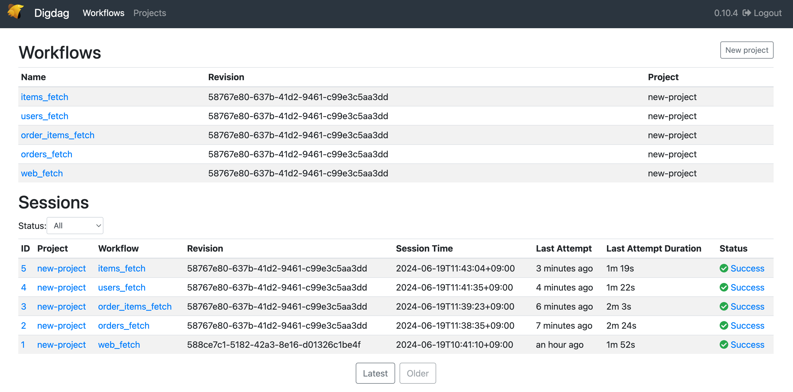

# practice_local_data_analysis

<p align="center">
  
</p>


[](https://www.docker.com/)


[](https://docs.docker.com/compose/)


# 起動方法

1.以下のコマンドを実行し、webserverにNEXTAUTHの設定ファイルを作る

```
bin/make_nextauth_env
```

2.docker composeを起動
```
docker compose up
```

# URL一覧

+ webアプリケーション: `http://localhsot:3000/`
+ Metabase: `http://localhsot:3001/`
+ Digtag:  `http://localhsot:65432/`


# ディレクトリ構成

```
.
├── README.md
├── bin
│   └── make_nextauth_env
├── compose.yaml
├── dataanalysis
│   ├── digdag
│   │   ├── database_sync
│   │   └── webdata_sync
│   ├── kafka
│   │   └── Dockerfile
│   └── spark
│       ├── Dockerfile
│       ├── docker-entrypoint.sh
│       ├── server.properties
│       └── streaming.py
├── dbserver
├── sources
└── webserver
```

+ bin: Bashスクリプトが含まれています。
+ compose.yml: Docker Composeの設定ファイルです。
+ dataanalysis: データ分析基盤の設定ファイルが含まれています。
    + digdag: データベース同期およびWebデータ同期用のスクリプトが含まれています。
    + kafka: Apache KafkaのDockerfileが含まれています。
    + spark: Apache Spark関連のファイルが含まれています。
        + Dockerfile: SparkのDockerイメージを作成するためのファイルです。
        + docker-entrypoint.sh: Dockerコンテナ起動時に実行されるエントリポイントスクリプトです。
        + server.properties: Sparkサーバーの設定ファイルです。
        + streaming.py: ストリーミング処理を行うPythonスクリプトです。
+ dbserver: データベースサーバー関連のファイルが含まれています。
+ sources: README.mdで使用するファイルが含まれています。
+ webserver: Webサーバー関連のファイルが含まれています。

# Digdagの登録と起動の方法
1. `http://localhsot:65432/`にアクセス、ダッシュボードが表示されます。
2. 新しいプロジェクトを作成するには、画面右上の「Create Project」ボタンをクリックします。
3. プロジェクト名と説明を入力し、「Create」をクリックします。
4. プロジェクトが作成されたら、次にワークフローを登録します。
5. プロジェクトの詳細ページに移動し、「Upload Workflow」ボタンをクリックします。
6. ワークフローの設定ファイル（.digファイル）を選択し、アップロードします。

    Digdagの設定ファイルはdatabase_syncとwebdata_syncに格納されています。
    ```
    ├── dataanalysis
    │   ├── digdag
    │   │   ├── database_sync
    │   │   └── webdata_sync
    ```

7. ワークフローがアップロードされたら、「Start Workflow」ボタンをクリックしてワークフローを起動します。
8. ワークフローの実行状況は、ダッシュボードやプロジェクトの詳細ページから確認できます。

# Digdagの結果

<p align="center">
  
</p>


